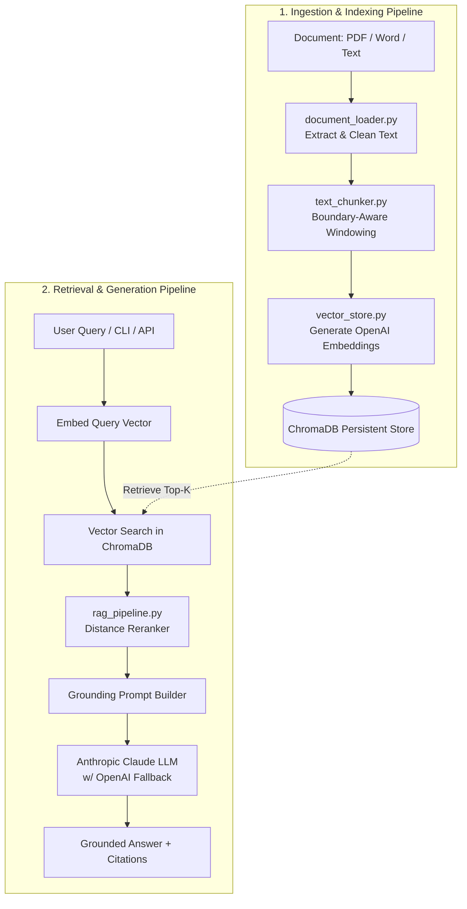

# 🔍 Advance Smart RAG Search Engine

[](https://www.python.org/)
[](https://fastapi.tiangolo.com/)
[](https://www.trychroma.com/)
[](https://platform.openai.com/)
[](https://www.anthropic.com/)
[](LICENSE)

An advanced, production-ready **Retrieval-Augmented Generation (RAG)** pipeline and API designed for intelligent semantic search and grounded question-answering over real-world documents (**PDF**, **Word .docx**, **Markdown**, and **Plain Text**).

---

## 🌟 Key Features

- 📑 **Multi-Format Document Parsing**: Seamlessly extracts and normalizes text from `.pdf`, `.docx`, `.doc`, `.md`, and `.txt` files.
- ✂️ **Boundary-Aware Text Chunking**: Context-preserving sliding window chunker that splits on paragraphs (`\n\n`), newlines (`\n`), sentences (`. `), and words—preventing truncated concepts.
- ⚡ **High-Performance Vector Storage**: Fast, persistent embedding storage using **ChromaDB** with duplicate-safe vector upserts.
- 🎯 **Semantic Similarity & Reranking**: Queries document embeddings via OpenAI's `text-embedding-3-small` with distance-based similarity reranking.
- 🤖 **Multi-Provider LLM Fallbacks**: Powered by **Anthropic Claude 3.5 / 3.7** with automatic version fallback and graceful failover to **OpenAI GPT-4o / GPT-4o-mini**.
- 🚀 **Dual Interface (CLI + REST API)**:
  - **CLI Mode**: Interactive terminal chat for rapid local querying and document ingestion.
  - **FastAPI Mode**: High-throughput asynchronous REST API with Swagger documentation and CORS support.

---

## 🏗️ System Architecture



---

## 📁 Repository Structure

```
SmartDocumentSearch/
├── config.py              # Centralized environment config & client setups
├── document_loader.py     # PDF, DOCX, and TXT extractors + cleaners
├── text_chunker.py        # Boundary-aware text sliding window chunker
├── vector_store.py        # Vector embedding generator & ChromaDB operations
├── rag_pipeline.py        # Semantic reranker, prompt synthesizer & LLM engine
├── api.py                 # FastAPI REST API endpoints (/index, /query) & CORS
├── cli.py                 # Interactive terminal chat & CLI indexing tool
├── smart_search.py        # Backwards-compatible unified entry point
├── requirements.txt       # Production dependencies
├── .env.example           # Configuration & API keys template
└── README.md              # Documentation
```

---

## 🚀 Quickstart Guide

### 1. Clone & Setup Virtual Environment

```bash
git clone https://github.com/Mettice/Advance-Smart-RAG-search-Engine.git
cd Advance-Smart-RAG-search-Engine

# Create virtual environment
python -m venv venv

# Activate virtual environment
# On Windows (PowerShell):
.\venv\Scripts\Activate.ps1
# On Linux/macOS:
source venv/bin/activate
```

### 2. Install Dependencies

```bash
pip install -r requirements.txt
```

### 3. Configure API Keys

Copy `.env.example` to `.env`:

```bash
cp .env.example .env
```

Edit `.env` with your API keys:

```ini
# Required API Keys
OPENAI_API_KEY="sk-proj-..."
ANTHROPIC_API_KEY="sk-ant-..."

# LLM Provider Configuration
LLM_PROVIDER="anthropic"           # "anthropic" or "openai"
ANTHROPIC_MODEL="claude-3-5-sonnet-20241022"
OPENAI_CHAT_MODEL="gpt-4o-mini"
EMBED_MODEL="text-embedding-3-small"

# Retrieval Hyperparameters
TOP_K=8
CHUNK_SIZE=1000
CHUNK_OVERLAP=200
CHROMA_PATH="./chroma_db"
```

---

## 💻 Usage

### 🖥️ Option 1: Terminal Interactive Chat (CLI)

1. **Index a document and immediately start chatting:**
   ```bash
   python cli.py CICD_Deployment_Notes.docx
   ```

2. **Chat against already indexed knowledge:**
   ```bash
   python cli.py
   ```

```
============================================================
 Smart Document Search — Terminal Chat
 Type 'quit' or 'exit' to terminate the session.
============================================================

>> What are the key stages in the CI/CD pipeline?

Based on the deployment notes, the CI/CD pipeline consists of:
1. Build & Lint Stage
2. Automated Unit and Integration Tests
3. Artifact Packaging (Docker containerization)
4. Staging Deployment & Smoke Tests
5. Production Rollout with Canary Verification

[Sources: CICD_Deployment_Notes.docx]
```

---

### 🌐 Option 2: FastAPI REST Service

Start the development server:

```bash
uvicorn api:app --reload
```

Visit the interactive Swagger UI at **[http://127.0.0.1:8000/docs](http://127.0.0.1:8000/docs)**.

#### 🔌 API Endpoints Reference

#### `POST /index`
Upload and index any supported document into the vector store.

* **cURL Example:**
  ```bash
  curl -X POST "http://127.0.0.1:8000/index" \
       -F "file=@CICD_Deployment_Notes.docx"
  ```
* **Response:**
  ```json
  {
    "filename": "CICD_Deployment_Notes.docx",
    "chunks_indexed": 233
  }
  ```

#### `POST /query`
Ask a natural language question across indexed documents.

* **cURL Example:**
  ```bash
  curl -X POST "http://127.0.0.1:8000/query" \
       -H "Content-Type: application/json" \
       -d '{"question": "How do we rollback a deployment?", "top_k": 5}'
  ```
* **Response:**
  ```json
  {
    "question": "How do we rollback a deployment?",
    "answer": "To rollback a deployment, trigger the rollback workflow in GitHub Actions or execute 'kubectl rollout undo deployment/api-service'.",
    "sources": ["CICD_Deployment_Notes.docx"]
  }
  ```

---

## ⚙️ Configuration Reference

| Parameter | Default Value | Description |
| :--- | :--- | :--- |
| `OPENAI_API_KEY` | *(Required)* | OpenAI API key for generating vector embeddings and fallback chat. |
| `ANTHROPIC_API_KEY` | *(Required)* | Anthropic API key for primary Claude generation. |
| `LLM_PROVIDER` | `anthropic` | Primary generation engine (`anthropic` or `openai`). |
| `ANTHROPIC_MODEL` | `claude-3-5-sonnet-20241022` | Anthropic model identifier (auto-falls back if unavailable). |
| `OPENAI_CHAT_MODEL` | `gpt-4o-mini` | OpenAI chat model for responses or failover. |
| `EMBED_MODEL` | `text-embedding-3-small` | OpenAI embedding model for vector representation. |
| `TOP_K` | `8` | Number of most relevant chunks retrieved per query. |
| `CHUNK_SIZE` | `1000` | Target character window length for each chunk. |
| `CHUNK_OVERLAP` | `200` | Overlap in characters between adjacent chunks. |
| `CHROMA_PATH` | `./chroma_db` | Local storage directory for ChromaDB embeddings. |

---

## 📄 Supported Formats

| Format | Extension | Parser Library |
| :--- | :--- | :--- |
| **PDF Documents** | `.pdf` | `pypdf` |
| **Microsoft Word** | `.docx`, `.doc` | `python-docx` |
| **Markdown** | `.md` | Native UTF-8 Reader |
| **Plain Text** | `.txt` | Native UTF-8 Reader |

---

## 🤝 Contributing

Contributions, issues, and feature requests are welcome! Feel free to check the [issues page](https://github.com/Mettice/Advance-Smart-RAG-search-Engine/issues).

---

## 📜 License

This project is licensed under the [MIT License](LICENSE).
